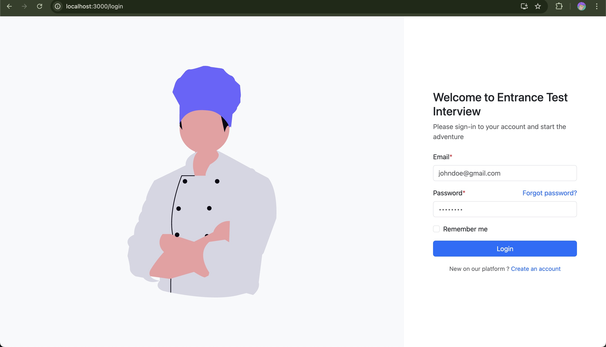

# Auth ReactJS

## Project Overview

This is a simple authentication demo built with ReactJS. It demonstrates user registration, login, protected routing, and dashboard access. The project uses React Router for navigation, Reactstrap for UI components, and communicates with a backend API for authentication.

## Main Features

- **User Registration:** Sign up with email, password, and personal details.
- **User Login:** Secure login with form validation.
- **Protected Routes:** Dashboard is accessible only to authenticated users.
- **Pre-auth Routes:** Redirects authenticated users away from login/signup pages.
- **Logout:** Securely sign out and clear session data.
- **Form Validation:** Client-side validation for all forms.
- **Responsive UI:** Built with Bootstrap and Reactstrap.

## Setup Steps

### Prerequisites

- [Node.js](https://nodejs.org/) (v22.16)
- [npm](https://www.npmjs.com/) (comes with Node.js)
- Backend API running at `https://localhost:7163` (or update the `proxy` in `package.json`)

### Installation

1. **Clone the repository:**
   ```bash
   git clone <your-repo-url>
   cd auth-reactjs
   ```

2. **Install dependencies:**
   ```bash
   npm install
   ```

3. **Start the development server:**
   ```bash
   npm start
   ```

4. **Open your browser:**
   - Visit [http://localhost:3000](http://localhost:3000)

### Notes

- Make sure your backend API is running and accessible at the proxy URL.
- The app uses localStorage to store authentication tokens and user info.

---

## Demo Screenshots

### Sign Up Page


### Login Page


### Dashboard

